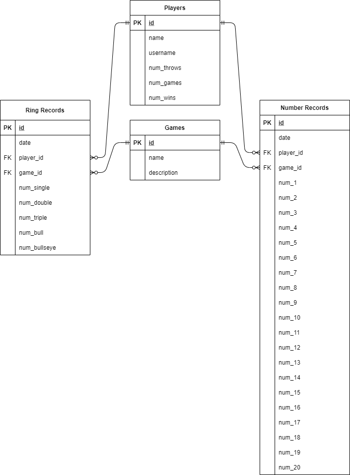

# Scoring

## Requirements
- Hardware
    - Raspberry Pi (3B+ or newer)
    - [Freenove Touchscreen](https://www.amazon.com/FREENOVE-Touchscreen-Raspberry-Capacitive-Driver-Free/dp/B0B455LDKH)
    - MicroSD Card (at least 64GB)
    - Power Supply to USB-C (15W)
- Software
    - [Raspberry Pi Imager](https://www.raspberrypi.com/documentation/computers/getting-started.html#raspberry-pi-imager)/Raspbian OS
    - Python (3.6 or greater)

## Setup
- Follow instructions for setting up the Raspberry Pi: [Getting started with your Raspberry Pi](https://www.raspberrypi.com/documentation/computers/getting-started.html)
- Follow instructions for setting up the FreeNove touchscreen: [Freenove Touchscreen Monitor for Raspberry Pi](https://github.com/Freenove/Freenove_Touchscreen_Monitor_for_Raspberry_Pi)
- Install the following:
    - Python package - [PyQt5](https://pypi.org/project/PyQt5/)
        ```
        sudo pip install PyQt5
        ```
    - Python package - [pyqt5-tools](https://pypi.org/project/pyqt5-tools/)
        ```
        sudo pip install pyqt5-tools
        ```
    - Python package - [uwsgi](https://uwsgi-docs.readthedocs.io/en/latest/Install.html)
        ```
        sudo pip install uwsgi
        ```
    - Utility installer - [snapd](https://snapcraft.io/snapd)
        ```
        sudo apt update
        sudo apt install snapd
        sudo reboot
        ```
        ```
        sudo snap install core
        ```
    - Text Editor - [gedit](https://snapcraft.io/gedit)
        ```
        sudo snap install gedit
        ```
    - Database Browser - [Install sqlitebrowser on Raspberry Pi](https://snapcraft.io/install/sqlitebrowser/raspbian)
        ```
        sudo snap install sqlitebrowser
        ```
    - On-Screen Keyboard - [Setting up an On-Screen Keyboard on Raspberry Pi](https://pimylifeup.com/raspberry-pi-on-screen-keyboard/)
        - Install keyboard
            ```
            sudo apt install matchbox-keyboard
            ```
        - Change default keyboard layout
            ```
            mkdir ~/.matchbox
            sudo cp /usr/share/matchbox-keyboard/keyboard-lq1.xml ~/.matchbox/keyboard.xml
            ```
        - Create execution script
            ```
            sudo nano /usr/bin/toggle-keyboard.sh
            ```
            ```
            #!/bin/bash
            PID="$(pidof matchbox-keyboard)"
            if [  "$PID" != ""  ]; then
              kill $PID
            else
             matchbox-keyboard &
            fi
            ```
            ```
            sudo chmod +x /usr/bin/toggle-keyboard.sh
            ```
        - Create desktop script
            ```
            sudo nano /usr/share/raspi-ui-overrides/applications/toggle-keyboard.desktop
            ```
            ```
            [Desktop Entry]
            Name=Toggle Virtual Keyboard
            Comment=Toggle Virtual Keyboard
            Exec=/usr/bin/toggle-keyboard.sh
            Type=Application
            Icon=matchbox-keyboard.png
            Categories=Panel;Utility;MB
            X-MB-INPUT-MECHANISM=True
            ```
        - Add to toolbar
            ```
            cp /etc/xdg/lxpanel/LXDE-pi/panels/panel /home/pi/.config/lxpanel/LXDE-pi/panels/panel
            nano /home/pi/.config/lxpanel/LXDE-pi/panels/panel
            Plugin {
              type=launchbar
              Config {
                Button {
                  id=toggle-keyboard.desktop
                }
              }
            }
            ```
- Set IP addresses
    - Configure DHCP to home network using onboard Wi-Fi
    - Set local Ethernet to static IP address
        ```
        10.0.0.2/8
        ```
        Port `5000` will be used for TCP/IP traffic to the [Imaging System](https://github.com/kparlak/dart-scoring-system/tree/main/imaging)
- Initialize database
    - Make database directory
        ```
        sudo mkdir /data
        sudo chmod 777 /data
        ```
    - Create tables
        ```
        ./initialize_database.py
        ```
    An SQLite database will be created at `/data/DARTS.db` referencing the entity relationship:
    

## Execution

### Tools
- Generate Python files from Qt ui files
    ```
    python -m PyQt5.uic.pyuic <file.ui> -o <file.py> -x
    ```
### Application
- Start web server
    ```
    uwsgi --http <DHCP Address>:9999 --wsgi-file handler.py
    ```
- Start command-line application
    ```
    ./main_scoring.py
    ```
- Start GUI application
    ```
    ./main_scoring_gui.py
    ```

## License
MIT
